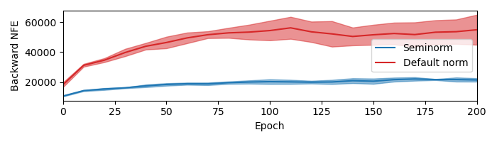

<h1 align='center'> "Hey, that's not an ODE":<BR>Faster ODE Adjoints with 12 Lines of Code<br>[<a href="https://arxiv.org/abs/2009.09457">arXiv</a>]</h1>

<p align="center">

</p>

One simple-to-implement trick dramatically improves the speed at which [Neural ODEs](https://arxiv.org/abs/1806.07366) and [Neural CDEs](https://arxiv.org/abs/2005.08926) can be trained.

Backpropagation through a Neural ODE/CDE can be performed via the "adjoint method", which involves solving another differential equation backwards in time.

However it turns out that default numerical solvers are unnecessarily stringent when solving the adjoint equation, and take too many steps, that are too small.

Tweaking things slightly reduces the number of function evaluations on the backward pass by as much as 62%. (Exact number will be problem-dependent, of course.)

---

## Summary:
If you're using [torchdiffeq](https://github.com/rtqichen/torchdiffeq) (at least version 0.1.0) then replace
```python
import torchdiffeq

func = ...
y0 = ...
t = ...
torchdiffeq.odeint_adjoint(func=func, y0=y0, t=t)
```
with
```python
import torchdiffeq

def rms_norm(tensor):
    return tensor.pow(2).mean().sqrt()

def make_norm(state):
    state_size = state.numel()
    def norm(aug_state):
        y = aug_state[1:1 + state_size]
        adj_y = aug_state[1 + state_size:1 + 2 * state_size]
        return max(rms_norm(y), rms_norm(adj_y))
    return norm

func = ...    
y0 = ...
t = ...
torchdiffeq.odeint_adjoint(func=func, y0=y0, t=t, 
                           adjoint_options=dict(norm=make_norm(y0)))
```
That's it.

## Reproducing experiments
The code for the Neural CDE and Symplectic ODE-Net experiments is available. (The CNF experiments were performed separately, just by adding the "12 lines of code" to the [FFJORD](https://github.com/rtqichen/ffjord) codebase.)

### Requirements
PyTorch >= 1.6    
[torchdiffeq](https://github.com/rtqichen/torchdiffeq) >= 0.1.0  
[torchcde](https://github.com/patrick-kidger/torchcde) >= 0.1.0  
[torchaudio](pytorch.org/audio/) >= 0.6.0  
[sklearn](https://scikit-learn.org/stable/) >= 0.23.1  
[gym](https://github.com/openai/gym) >= 0.17.2  
[tqdm](https://github.com/tqdm/tqdm) >= 4.47.0

In summary:
```bash
conda install pytorch torchaudio -c pytorch
pip install torchdiffeq scikit-learn gym tqdm
pip install git+https://github.com/patrick-kidger/torchcde.git
```

### Neural CDEs
```bash
python
>>> import speech_commands
>>> device = 'cuda'
>>> norm = False  # don't use our trick
>>> norm = True   # use our trick
>>> rtol = 1e-3
>>> atol = 1e-5
>>> results = speech_commands.main(device, norm, rtol, atol)
>>> print(results.keys())  # inspect results object
>>> print(results.test_metrics.accuracy)  # query results object
```

### Symplectic ODE-Net
```bash
python
>>> import acrobot
>>> device = 'cuda'
>>> norm = False  # don't use our trick
>>> norm = True   # use our trick
>>> results = acrobot.main(device, norm)
>>> print(results.keys())  # inspect results object
>>> print(results.test_metrics.loss)  # query results object
```
---

## Citation
```bibtex
@article{kidger2020hey,
    author={Kidger, Patrick and Chen, Ricky T. Q. and Lyons, Terry},
    title={{``Hey, that's not an ODE'': Faster ODE Adjoints with 12 Lines of Code}},
    year={2020},
    journal={arXiv:2009.09457}
}
```
